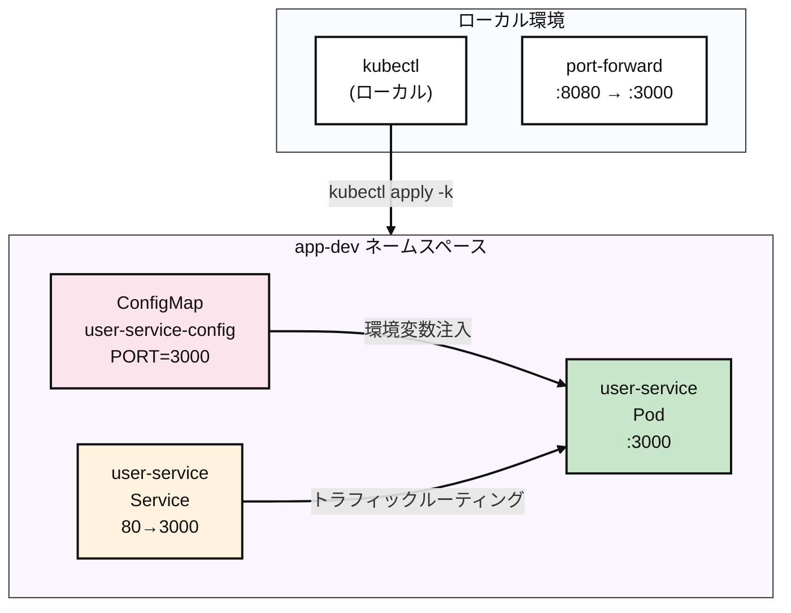

# Kubernetes Pod

## Contents 

### 概要 (TL;DR)

このガイドは**Kubernetes初心者**向けのPodデプロイメント実習書です！

- **何を**: kubectlコマンドでWebアプリケーションをKubernetesにデプロイし、実行状態を確認する
- **なぜ**: Dockerコンテナを実際のサーバー環境（Kubernetes）で動かして、問題解決方法を学ぶため
- **結果**: 自分のコンピューターで`curl localhost:8080`を実行すると`{"ok":true}`レスポンスが返るWebサーバーの完成

> 💡 **こんな方におすすめ**: Dockerは使ったことがあるけどKubernetesは初めての方、kubectlコマンドに馴染みのない方

- **5分で完了**:

```bash
$ kubectl apply -k k8s/overlays/dev
namespace/app-dev created
configmap/user-service-config created
service/user-service created
pod/user-service created

$ kubectl -n app-dev get all
NAME               READY   STATUS    RESTARTS   AGE
pod/user-service   1/1     Running   0          26s

NAME                   TYPE        CLUSTER-IP      EXTERNAL-IP   PORT(S)   AGE
service/user-service   ClusterIP   10.97.221.189   <none>        80/TCP    26s

$ kubectl -n app-dev port-forward pod/user-service 8080:3000 &
Forwarding from [::1]:8080 -> 3000

$ curl http://localhost:8080
{"ok":true}

$ kubectl delete ns app-dev
namespace "app-dev" deleted
```

### 1. 作成するもの (What you'll build)

- **目標アーキテクチャ**:



- **作成するコンポーネント**
  - **Namespace** `app-dev`: プロジェクト専用の独立した空間（他のアプリと混在しないよう隔離）
  - **Pod** `user-service`: 実際のWebサーバーが動作するコンテナ（Dockerコンテナに似ている）
  - **Service** `user-service`: Podへの接続を可能にする「ゲートウェイ」の役割
  - **ConfigMap** `user-service-config`: Webサーバーの設定情報を保存する場所（ポート番号など）

- **成功判定基準**
  - `kubectl get pods`でReady=1/1、Status=Running
  - `kubectl logs`で「🚀 User service is running」メッセージを確認
  - Service Discoveryテスト: `curl http://user-service/`で200 OK
  - 外部アクセステスト: `curl localhost:8080`で`{"ok":true}`レスポンス
  - すべてのリソースの正常削除完了

### 2. 前提条件 (Prerequisites)

- OS: Linux / macOS / Windows 11 + WSL2(Ubuntu 22.04+)
- kubectl: v1.27+ (-k対応、Kustomize内蔵)
- コンテナランタイム: Docker（推奨）またはcontainerd（+nerdctl）
- ローカルクラスタ（いずれか選択）
  - Minikube v1.33+（Dockerドライバー推奨）
  - またはkind / k3d、または既にアクセス可能なK8sクラスタ
- レジストリアクセス: Docker Hub pull可能（プライベートならdocker login）
- ネットワーク/ポート: アウトバウンドHTTPS可能、ローカル8080ポートが空いている
- 検証ツール: curl（レスポンス確認用）

```bash
# クラスタ接続確認
$ kubectl cluster-info
Kubernetes control plane is running at https://192.168.49.2:8443
CoreDNS is running at https://192.168.49.2:8443/api/v1/namespaces/kube-system/services/kube-dns:dns/proxy

$ kubectl get nodes
NAME       STATUS   ROLES           AGE   VERSION
minikube   Ready    control-plane   19h   v1.33.1
```

### 3. 核心概念まとめ (Core Concepts)

- **理解すべきポイント**:
  - **Kustomize**: `base/` + `overlays/`パターンによる環境別設定管理
  - **Service Discovery**: Pod間通信のためのDNSベースのサービス名解決
  - **ConfigMap Injection**: コンテナへの環境変数注入方式
  - **Port-forward**: ローカルからPodへの直接トンネリングデバッグツール
  - **Resource Lifecycle**: apply → running → delete全体フロー

| 区分 | 説明 | 注意事項 |
|------|------|----------|
| `kubectl apply -k` | Kustomizationディレクトリ全体適用 | `-f`と異なり複数リソースを一度に処理 |
| `kubectl exec -it` | コンテナ内部シェルアクセス | コンテナにシェル（sh/bash）が必要 |
| `kubectl port-forward` | ローカル→Podトンネリング | バックグラウンドプロセスとして残る可能性 |

### 4. 実装 (Step-by-step)

#### 4.1 マニフェスト構造確認

```yaml
# k8s/base/deployment.yaml
# 目的: 環境変数注入と適切なラベルを持つ単一Pod
apiVersion: v1
kind: Pod
metadata:
  name: user-service
  labels:
    app.kubernetes.io/name: user-service
spec:
  containers:
    - name: app
      image: mogumogusityau/user-service:1.1.0
      imagePullPolicy: IfNotPresent
      ports:
        - containerPort: 3000
      env:
        - name: PORT
          valueFrom:
            configMapKeyRef:
              name: user-service-config
              key: PORT
```

```yaml
# k8s/base/service.yaml  
# 目的: 標準HTTPポートを通じたクラスタ内部通信
apiVersion: v1
kind: Service
metadata:
  name: user-service
spec:
  selector:
    app.kubernetes.io/name: user-service
  ports:
    - name: http
      port: 80
      targetPort: 3000
  type: ClusterIP
```

```yaml
# k8s/base/configmap.yaml
# 目的: 中央集約型設定管理
apiVersion: v1
kind: ConfigMap
metadata:
  name: user-service-config
data:
  PORT: "3000"
```

#### 4.2 デプロイメントと初期状態確認

```bash
# Kustomizeを使用してすべてのリソースを適用
$ kubectl apply -k k8s/overlays/dev

namespace/app-dev created
configmap/user-service-config created
service/user-service created
pod/user-service created

# すべてのリソースが作成されたか確認
$ kubectl -n app-dev get all -o wide
NAME               READY   STATUS    RESTARTS   AGE   IP            NODE       NOMINATED NODE   READINESS GATES
pod/user-service   1/1     Running   0          24s   10.244.0.13   minikube   <none>           <none>

NAME                   TYPE        CLUSTER-IP    EXTERNAL-IP   PORT(S)   AGE   SELECTOR
service/user-service   ClusterIP   10.108.3.31   <none>        80/TCP    24s   app.kubernetes.io/name=user-service

$ kubectl -n app-dev get configmap,pod,service
NAME                            DATA   AGE
configmap/kube-root-ca.crt      1      37s
configmap/user-service-config   1      37s

NAME               READY   STATUS    RESTARTS   AGE
pod/user-service   1/1     Running   0          37s

NAME                   TYPE        CLUSTER-IP    EXTERNAL-IP   PORT(S)   AGE
service/user-service   ClusterIP   10.108.3.31   <none>        80/TCP    37s
```

#### 4.3 詳細検証 (Verification)

```bash
# 1. Pod状態詳細照会
$ kubectl -n app-dev describe pod user-service
Name:             user-service
Namespace:        app-dev
Service Account:  default
Node:             minikube/<IP>
Start Time:       <TIMESTAMP>
Labels:           app.kubernetes.io/name=user-service
                  app.kubernetes.io/part-of=demo
                  environment=dev
Status:           Running
IP:               <IP>
Containers:
  app:
    Image:          mogumogusityau/user-service:1.1.0
    Image ID:       docker-pullable://mogumogusityau/user-service@sha256:<DIGEST>
    Port:           3000/TCP
    State:          Running
    Ready:          True
    Environment:
      PORT:  <set to the key 'PORT' of config map 'user-service-config'>
Events:
  Normal  Scheduled  ...  default-scheduler  Successfully assigned app-dev/user-service to minikube
  Normal  Pulled     ...
  Normal  Created    ...
  Normal  Started    ...

# 2. リアルタイムログ確認（起動メッセージチェック）
$ kubectl -n app-dev logs pod/user-service -f
🚀 User service is running on http://0.0.0.0:3000

# 3. 内部Service Discoveryテスト
$ kubectl -n app-dev run alpine-test --rm -it --image=alpine:3.19 -- \
  sh -c 'apk add --no-cache curl && curl -v http://user-service/'

{"ok":true}
```

#### 4.4 外部アクセステスト (External Access)

```bash
# ローカルテストのためのポートフォワーディング
$ kubectl -n app-dev port-forward pod/user-service 8080:3000 &
Forwarding from [::1]:8080 -> 3000

# 外部接続性テスト
$ curl -v http://localhost:8080
{"ok":true}
```

### 5. ロールバック/クリーンアップ (Rollback & Cleanup)

```bash
# 完全なクリーンアップ（推奨）
$ kubectl delete namespace app-dev
namespace "app-dev" deleted

# すべてのリソースが削除されたか確認
$ kubectl get all -n app-dev
No resources found in app-dev namespace.

# port-forwardプロセスのクリーンアップ
$ sudo lsof -i :8080
COMMAND     PID     USER   FD   TYPE  DEVICE SIZE/OFF NODE NAME
kubectl 2779071 mogumogu    7u  IPv4 6153381      0t0  TCP localhost:http-alt (LISTEN)
kubectl 2779071 mogumogu    8u  IPv6 6153383      0t0  TCP ip6-localhost:http-alt (LISTEN)

# 残りのプロセスを終了
$ kill -9 <PID>
```

### 6. まとめ (Conclusion)

このガイドを通じて**kubectlのコアワークフロー**を完全に体験しました：

* **デプロイメント**: `kubectl apply -k`によるKustomizeベースのリソース管理
* **検証**: `describe`、`logs`、`exec`による多角的状態チェック  
* **テスト**: Service Discoveryとport-forwardによる接続性確認
* **クリーンアップ**: namespace削除による環境の清浄な復元

**コア学習ポイント**:
- ConfigMapによる環境変数注入パターン
- Pod ↔ Service ↔ 外部アクセスのネットワーキングフロー
- 実際の本番環境でよく使われるkubectlデバッグコマンド群

この資料は次の[repository](https://github.com/mogumogu-lab/k8s-pod)で確認できます。次回はより良いコンテンツでお会いできるよう努力いたします。