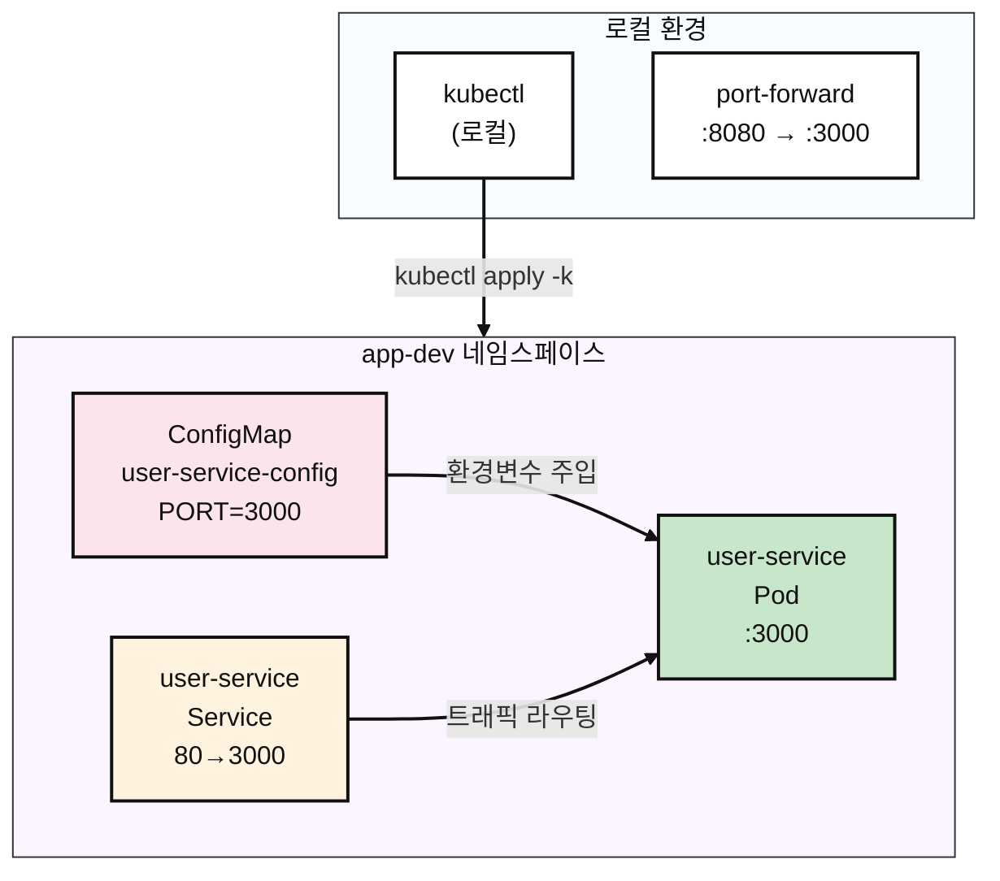

# Kubernetes Pod

## Contents 

### 요약 (TL;DR)

이 가이드는 **Kubernetes 초보자**를 위한 Pod 배포 실습서입니다!

- **무엇을**: kubectl 명령어로 웹 애플리케이션을 Kubernetes에 배포하고 실행 상태를 확인해보기
- **왜**: Docker 컨테이너를 실제 서버환경(Kubernetes)에서 돌려보고 문제 해결 방법을 배우기 위해
- **결과**: 내 컴퓨터에서 `curl localhost:8080`을 치면 `{"ok":true}` 응답이 나오는 웹서버 완성

> 💡 **이런 분들께 추천**: Docker는 써봤는데 Kubernetes는 처음이신 분, kubectl 명령어가 낯선 분

- **5분 만에 끝내기**:

```bash
$ kubectl apply -k k8s/overlays/dev
namespace/app-dev created
configmap/user-service-config created
service/user-service created
pod/user-service created

$ kubectl -n app-dev get all
NAME               READY   STATUS    RESTARTS   AGE
pod/user-service   1/1     Running   0          26s

NAME                   TYPE        CLUSTER-IP      EXTERNAL-IP   PORT(S)   AGE
service/user-service   ClusterIP   10.97.221.189   <none>        80/TCP    26s

$ kubectl -n app-dev port-forward pod/user-service 8080:3000 &
Forwarding from [::1]:8080 -> 3000

$ curl http://localhost:8080
{"ok":true}

$ kubectl delete ns app-dev
namespace "app-dev" deleted
```

### 1. 우리가 만들 것 (What you’ll build)

- **목표 아키텍처**:



- **만들게 될 것들**
  - **Namespace** `app-dev`: 프로젝트만의 독립적인 공간 (다른 앱들과 섞이지 않게 격리)
  - **Pod** `user-service`: 실제 웹서버가 돌아가는 컨테이너 (Docker 컨테이너와 비슷)
  - **Service** `user-service`: Pod에 접속할 수 있게 해주는 "문" 역할
  - **ConfigMap** `user-service-config`: 웹서버 설정 정보를 저장하는 곳 (포트번호 등)

- **성공 판정 기준**
  - `kubectl get pods`에서 Ready=1/1, Status=Running
  - `kubectl logs`에서 "🚀 User service is running" 메시지 확인
  - Service Discovery 테스트: `curl http://user-service/`에서 200 OK
  - 외부 접근 테스트: `curl localhost:8080`에서 `{"ok":true}` 응답
  - 모든 리소스 정상 삭제 완료

### 2. 준비물 (Prereqs)

- OS: Linux / macOS / Windows 11 + WSL2(Ubuntu 22.04+)
- kubectl: v1.27+ (-k 지원, Kustomize 내장)
- 컨테이너 런타임: Docker(권장) 또는 containerd(+nerdctl)
- 로컬 클러스터(택1)
  - Minikube v1.33+ (Docker driver 권장)
  - 또는 kind / k3d, 또는 이미 접근 가능한 K8s 클러스터
- 레지스트리 접근: Docker Hub pull 가능(프라이빗이면 docker login)
- 네트워크/포트: 아웃바운드 HTTPS 가능, 로컬 8080 포트 비어있음
- 검증 도구: curl (응답 확인용)

```bash
# 클러스터 연결 확인
$ kubectl cluster-info
Kubernetes control plane is running at https://192.168.49.2:8443
CoreDNS is running at https://192.168.49.2:8443/api/v1/namespaces/kube-system/services/kube-dns:dns/proxy

$ kubectl get nodes
NAME       STATUS   ROLES           AGE   VERSION
minikube   Ready    control-plane   19h   v1.33.1
```

### 3. 핵심 개념 요약 (Concepts)

- **꼭 알아야 할 포인트**:
  - **Kustomize**: `base/` + `overlays/` 패턴으로 환경별 구성 관리
  - **Service Discovery**: Pod간 통신을 위한 DNS 기반 서비스 이름 해석
  - **ConfigMap Injection**: 환경변수를 컨테이너에 주입하는 방식
  - **Port-forward**: 로컬에서 Pod로 직접 터널링하는 디버깅 도구
  - **Resource Lifecycle**: apply → running → delete 전체 흐름

| 구분 | 설명 | 주의사항 |
|------|------|----------|
| `kubectl apply -k` | Kustomization 디렉토리 전체 적용 | `-f`와 달리 여러 리소스 한번에 처리 |
| `kubectl exec -it` | 컨테이너 내부 셸 접근 | 컨테이너에 셸(sh/bash)이 있어야 함 |
| `kubectl port-forward` | 로컬→Pod 터널링 | 백그라운드 프로세스로 남을 수 있음 |

### 4. 구현 (Step-by-step)

#### 4.1 매니페스트 구조 확인

```yaml
# k8s/base/deployment.yaml
# 목적: 환경변수 주입과 적절한 라벨을 가진 단일 Pod
apiVersion: v1
kind: Pod
metadata:
  name: user-service
  labels:
    app.kubernetes.io/name: user-service
spec:
  containers:
    - name: app
      image: mogumogusityau/user-service:1.1.0
      imagePullPolicy: IfNotPresent
      ports:
        - containerPort: 3000
      env:
        - name: PORT
          valueFrom:
            configMapKeyRef:
              name: user-service-config
              key: PORT
```

```yaml
# k8s/base/service.yaml  
# 목적: 표준 HTTP 포트를 통한 클러스터 내부 통신
apiVersion: v1
kind: Service
metadata:
  name: user-service
spec:
  selector:
    app.kubernetes.io/name: user-service
  ports:
    - name: http
      port: 80
      targetPort: 3000
  type: ClusterIP
```

```yaml
# k8s/base/configmap.yaml
# 목적: 중앙 집중식 설정 관리
apiVersion: v1
kind: ConfigMap
metadata:
  name: user-service-config
data:
  PORT: "3000"
```

#### 4.2 배포 및 초기 상태 확인

```bash
# Kustomize를 사용해서 모든 리소스 적용
$ kubectl apply -k k8s/overlays/dev

namespace/app-dev created
configmap/user-service-config created
service/user-service created
pod/user-service created

# 모든 리소스가 생성되었는지 확인
$ kubectl -n app-dev get all -o wide
NAME               READY   STATUS    RESTARTS   AGE   IP            NODE       NOMINATED NODE   READINESS GATES
pod/user-service   1/1     Running   0          24s   10.244.0.13   minikube   <none>           <none>

NAME                   TYPE        CLUSTER-IP    EXTERNAL-IP   PORT(S)   AGE   SELECTOR
service/user-service   ClusterIP   10.108.3.31   <none>        80/TCP    24s   app.kubernetes.io/name=user-service

$ kubectl -n app-dev get configmap,pod,service
NAME                            DATA   AGE
configmap/kube-root-ca.crt      1      37s
configmap/user-service-config   1      37s

NAME               READY   STATUS    RESTARTS   AGE
pod/user-service   1/1     Running   0          37s

NAME                   TYPE        CLUSTER-IP    EXTERNAL-IP   PORT(S)   AGE
service/user-service   ClusterIP   10.108.3.31   <none>        80/TCP    37s
```

#### 4.3 상세 검증 (Verification)

```bash
# 1. Pod 상태 상세 조회
$ kubectl -n app-dev describe pod user-service
Name:             user-service
Namespace:        app-dev
Service Account:  default
Node:             minikube/<IP>
Start Time:       <TIMESTAMP>
Labels:           app.kubernetes.io/name=user-service
                  app.kubernetes.io/part-of=demo
                  environment=dev
Status:           Running
IP:               <IP>
Containers:
  app:
    Image:          mogumogusityau/user-service:1.1.0
    Image ID:       docker-pullable://mogumogusityau/user-service@sha256:<DIGEST>
    Port:           3000/TCP
    State:          Running
    Ready:          True
    Environment:
      PORT:  <set to the key 'PORT' of config map 'user-service-config'>
Events:
  Normal  Scheduled  ...  default-scheduler  Successfully assigned app-dev/user-service to minikube
  Normal  Pulled     ...
  Normal  Created    ...
  Normal  Started    ...

# 2. 실시간 로그 확인 (startup message 체크)
$ kubectl -n app-dev logs pod/user-service -f
🚀 User service is running on http://0.0.0.0:3000

# 3. 내부 Service Discovery 테스트
$ kubectl -n app-dev run alpine-test --rm -it --image=alpine:3.19 -- \
  sh -c 'apk add --no-cache curl && curl -v http://user-service/'

{"ok":true}
```

#### 4.4 외부 접근 테스트 (External Access)

```bash
# 로컬 테스트를 위한 포트 포워딩
$ kubectl -n app-dev port-forward pod/user-service 8080:3000 &
Forwarding from [::1]:8080 -> 3000

# 외부 연결성 테스트
$ curl -v http://localhost:8080
{"ok":true}
```

### 5. 롤백/청소 (Rollback & Cleanup)

```bash
# 완전한 정리 (권장)
$ kubectl delete namespace app-dev
namespace "app-dev" deleted

# 모든 리소스가 삭제되었는지 확인
$ kubectl get all -n app-dev
No resources found in app-dev namespace.

# port-forward 프로세스 정리
$ sudo lsof -i :8080
COMMAND     PID     USER   FD   TYPE  DEVICE SIZE/OFF NODE NAME
kubectl 2779071 mogumogu    7u  IPv4 6153381      0t0  TCP localhost:http-alt (LISTEN)
kubectl 2779071 mogumogu    8u  IPv6 6153383      0t0  TCP ip6-localhost:http-alt (LISTEN)

# 남아있는 프로세스 종료
$ kill -9 <PID>
```

### 6. 마무리 (Conclusion)

이 가이드를 통해 **kubectl의 핵심 워크플로우**를 완전히 경험했습니다:

* **배포**: `kubectl apply -k`로 Kustomize 기반 리소스 관리
* **검증**: `describe`, `logs`, `exec`로 다각도 상태 점검  
* **테스트**: Service Discovery와 port-forward를 통한 연결성 확인
* **정리**: namespace 삭제로 깔끔한 환경 복원

**핵심 학습 포인트**:
- ConfigMap을 통한 환경변수 주입 패턴
- Pod ↔ Service ↔ 외부 접근의 네트워킹 흐름
- 실제 운영 환경에서 자주 사용하는 kubectl 디버깅 명령어들

해당 자료는 다음 [repository](https://github.com/mogumogu-lab/k8s-pod)에서 확인할 수 있습니다. 다음에는 더 좋은 글로 찾아뵐 수 있도록 하겠습니다.