# Kubernetes Pod

## Contents 

### Summary (TL;DR)

This guide is a **Kubernetes Pod deployment tutorial for beginners**!

- **What**: Deploy a web application to Kubernetes using kubectl commands and verify its running status
- **Why**: To run Docker containers in a real server environment (Kubernetes) and learn troubleshooting methods
- **Result**: A complete web server that responds with `{"ok":true}` when you run `curl localhost:8080` on your computer

> 💡 **Recommended for**: Those who have used Docker but are new to Kubernetes, those unfamiliar with kubectl commands

- **Quick 5-minute setup**:

```bash
$ kubectl apply -k k8s/overlays/dev
namespace/app-dev created
configmap/user-service-config created
service/user-service created
pod/user-service created

$ kubectl -n app-dev get all
NAME               READY   STATUS    RESTARTS   AGE
pod/user-service   1/1     Running   0          26s

NAME                   TYPE        CLUSTER-IP      EXTERNAL-IP   PORT(S)   AGE
service/user-service   ClusterIP   10.97.221.189   <none>        80/TCP    26s

$ kubectl -n app-dev port-forward pod/user-service 8080:3000 &
Forwarding from [::1]:8080 -> 3000

$ curl http://localhost:8080
{"ok":true}

$ kubectl delete ns app-dev
namespace "app-dev" deleted
```

### 1. What You'll Build

- **Target Architecture**:

```mermaid
flowchart TB
    %% Strong black borders for all key nodes
    classDef strong stroke:#111,stroke-width:2px,color:#111;

    subgraph Local["Local Environment"]
        kubectl["kubectl<br/>(local)"]
        portforward["port-forward<br/>:8080 → :3000"]
    end
    
    subgraph K8s["app-dev namespace"]
        pod["user-service<br/>Pod<br/>:3000"]
        service["user-service<br/>Service<br/>80→3000"]
        configmap["ConfigMap<br/>user-service-config<br/>PORT=3000"]
    end
     
    kubectl -->|kubectl apply -k| K8s
    configmap -->|env injection| pod
    service -->|traffic routing| pod

    %% Softer cluster backgrounds (outer boxes)
    style Local fill:#F9FCFF,stroke:#333,color:#111
    style K8s  fill:#FAF5FF,stroke:#333,color:#111

    %% Inner node fills as you like, but borders are strong black
    style pod      fill:#c8e6c9
    style service  fill:#fff3e0
    style configmap fill:#fce4ec
    style kubectl fill:#FFFFFF,stroke:#111,stroke-width:2px,color:#111
    style portforward fill:#FFFFFF,stroke:#111,stroke-width:2px,color:#111

    %% Apply strong border class to key nodes
    class kubectl,portforward,pod,service,configmap strong

    %% Darken all edges
    linkStyle default stroke:#111,stroke-width:2px;
```



- **Components we'll create**
  - **Namespace** `app-dev`: An isolated space for your project (separated from other apps)
  - **Pod** `user-service`: The container where the actual web server runs (similar to Docker container)
  - **Service** `user-service`: Acts as a "gateway" to access the Pod
  - **ConfigMap** `user-service-config`: Stores web server configuration (port numbers, etc.)

- **Success criteria**
  - `kubectl get pods` shows Ready=1/1, Status=Running
  - `kubectl logs` shows "🚀 User service is running" message
  - Service Discovery test: `curl http://user-service/` returns 200 OK
  - External access test: `curl localhost:8080` returns `{"ok":true}` response
  - All resources cleanly deleted

### 2. Prerequisites

- OS: Linux / macOS / Windows 11 + WSL2(Ubuntu 22.04+)
- kubectl: v1.27+ (supports -k, built-in Kustomize)
- Container runtime: Docker (recommended) or containerd(+nerdctl)
- Local cluster (choose one)
  - Minikube v1.33+ (Docker driver recommended)
  - Or kind / k3d, or already accessible K8s cluster
- Registry access: Docker Hub pull available (docker login if private)
- Network/ports: Outbound HTTPS available, local port 8080 free
- Verification tools: curl (for response checking)

```bash
# Check cluster connection
$ kubectl cluster-info
Kubernetes control plane is running at https://192.168.49.2:8443
CoreDNS is running at https://192.168.49.2:8443/api/v1/namespaces/kube-system/services/kube-dns:dns/proxy

$ kubectl get nodes
NAME       STATUS   ROLES           AGE   VERSION
minikube   Ready    control-plane   19h   v1.33.1
```

### 3. Core Concepts Summary

- **Key points to understand**:
  - **Kustomize**: Environment-specific configuration management with `base/` + `overlays/` pattern
  - **Service Discovery**: DNS-based service name resolution for Pod-to-Pod communication
  - **ConfigMap Injection**: Method to inject environment variables into containers
  - **Port-forward**: Debugging tool for direct tunneling from local to Pod
  - **Resource Lifecycle**: Complete flow of apply → running → delete

| Command | Description | Notes |
|---------|-------------|--------|
| `kubectl apply -k` | Apply entire Kustomization directory | Processes multiple resources at once, unlike `-f` |
| `kubectl exec -it` | Access container internal shell | Container must have shell (sh/bash) available |
| `kubectl port-forward` | Local→Pod tunneling | May remain as background process |

### 4. Implementation (Step-by-step)

#### 4.1 Manifest Structure Review

```yaml
# k8s/base/deployment.yaml
# Purpose: Single Pod with environment variable injection and proper labels
apiVersion: v1
kind: Pod
metadata:
  name: user-service
  labels:
    app.kubernetes.io/name: user-service
spec:
  containers:
    - name: app
      image: mogumogusityau/user-service:1.1.0
      imagePullPolicy: IfNotPresent
      ports:
        - containerPort: 3000
      env:
        - name: PORT
          valueFrom:
            configMapKeyRef:
              name: user-service-config
              key: PORT
```

```yaml
# k8s/base/service.yaml  
# Purpose: Cluster-internal communication through standard HTTP port
apiVersion: v1
kind: Service
metadata:
  name: user-service
spec:
  selector:
    app.kubernetes.io/name: user-service
  ports:
    - name: http
      port: 80
      targetPort: 3000
  type: ClusterIP
```

```yaml
# k8s/base/configmap.yaml
# Purpose: Centralized configuration management
apiVersion: v1
kind: ConfigMap
metadata:
  name: user-service-config
data:
  PORT: "3000"
```

#### 4.2 Deployment and Initial Status Check

```bash
# Apply all resources using Kustomize
$ kubectl apply -k k8s/overlays/dev

namespace/app-dev created
configmap/user-service-config created
service/user-service created
pod/user-service created

# Verify all resources are created
$ kubectl -n app-dev get all -o wide
NAME               READY   STATUS    RESTARTS   AGE   IP            NODE       NOMINATED NODE   READINESS GATES
pod/user-service   1/1     Running   0          24s   10.244.0.13   minikube   <none>           <none>

NAME                   TYPE        CLUSTER-IP    EXTERNAL-IP   PORT(S)   AGE   SELECTOR
service/user-service   ClusterIP   10.108.3.31   <none>        80/TCP    24s   app.kubernetes.io/name=user-service

$ kubectl -n app-dev get configmap,pod,service
NAME                            DATA   AGE
configmap/kube-root-ca.crt      1      37s
configmap/user-service-config   1      37s

NAME               READY   STATUS    RESTARTS   AGE
pod/user-service   1/1     Running   0          37s

NAME                   TYPE        CLUSTER-IP    EXTERNAL-IP   PORT(S)   AGE
service/user-service   ClusterIP   10.108.3.31   <none>        80/TCP    37s
```

#### 4.3 Detailed Verification

```bash
# 1. Detailed Pod status inquiry
$ kubectl -n app-dev describe pod user-service
Name:             user-service
Namespace:        app-dev
Service Account:  default
Node:             minikube/<IP>
Start Time:       <TIMESTAMP>
Labels:           app.kubernetes.io/name=user-service
                  app.kubernetes.io/part-of=demo
                  environment=dev
Status:           Running
IP:               <IP>
Containers:
  app:
    Image:          mogumogusityau/user-service:1.1.0
    Image ID:       docker-pullable://mogumogusityau/user-service@sha256:<DIGEST>
    Port:           3000/TCP
    State:          Running
    Ready:          True
    Environment:
      PORT:  <set to the key 'PORT' of config map 'user-service-config'>
Events:
  Normal  Scheduled  ...  default-scheduler  Successfully assigned app-dev/user-service to minikube
  Normal  Pulled     ...
  Normal  Created    ...
  Normal  Started    ...

# 2. Real-time log check (startup message verification)
$ kubectl -n app-dev logs pod/user-service -f
🚀 User service is running on http://0.0.0.0:3000

# 3. Internal Service Discovery test
$ kubectl -n app-dev run alpine-test --rm -it --image=alpine:3.19 -- \
  sh -c 'apk add --no-cache curl && curl -v http://user-service/'

{"ok":true}
```

#### 4.4 External Access Test

```bash
# Port forwarding for local testing
$ kubectl -n app-dev port-forward pod/user-service 8080:3000 &
Forwarding from [::1]:8080 -> 3000

# External connectivity test
$ curl -v http://localhost:8080
{"ok":true}
```

### 5. Rollback & Cleanup

```bash
# Complete cleanup (recommended)
$ kubectl delete namespace app-dev
namespace "app-dev" deleted

# Verify all resources are deleted
$ kubectl get all -n app-dev
No resources found in app-dev namespace.

# Clean up port-forward processes
$ sudo lsof -i :8080
COMMAND     PID     USER   FD   TYPE  DEVICE SIZE/OFF NODE NAME
kubectl 2779071 mogumogu    7u  IPv4 6153381      0t0  TCP localhost:http-alt (LISTEN)
kubectl 2779071 mogumogu    8u  IPv6 6153383      0t0  TCP ip6-localhost:http-alt (LISTEN)

# Terminate remaining processes
$ kill -9 <PID>
```

### 6. Conclusion

Through this guide, you've fully experienced **kubectl's core workflow**:

* **Deployment**: Kustomize-based resource management with `kubectl apply -k`
* **Verification**: Multi-angle status checking with `describe`, `logs`, `exec`  
* **Testing**: Connectivity verification through Service Discovery and port-forward
* **Cleanup**: Clean environment restoration with namespace deletion

**Key learning points**:
- Environment variable injection pattern through ConfigMap
- Networking flow of Pod ↔ Service ↔ external access
- kubectl debugging commands frequently used in real production environments

You can find this material in the following [repository](https://github.com/mogumogu-lab/k8s-pod). I hope to return with better content next time.